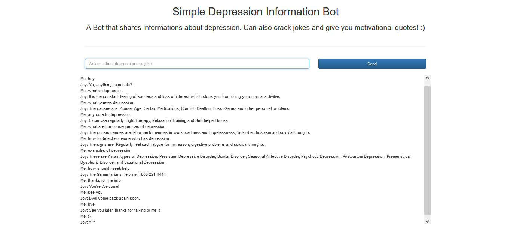
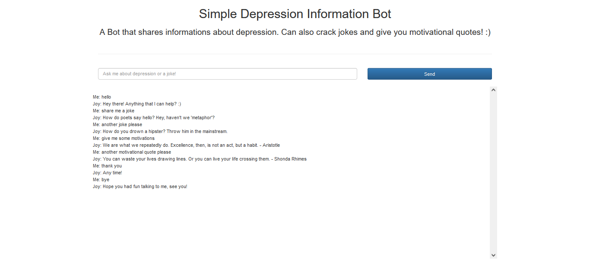

# Simple Depression Infromation Bot
### A pet project built out of the interest for chatbots :)
_A simple chatbot application built using Flask, focusing on information of depression and also generating jokes and motivational quotes._   
   
 ## Libraries Needed
- flask  
- waitress  
- random  
- json  
- pytorch  
- nltk  
- numpy  

## Additional Frontend Code Needed
- bootstrap  
- jQuery  
   
## Code files in this repository
- templates/index.html => Frontend code to show the simple user interface using HTML, jQuery and Bootstrap    
- app.py => The main web app built using Flask   
- chat_terminal.py => A test code to check if the chatbot is functioning on the command line before integrating it with the frontend   
- evaluation.py => To evaluate which class does the input (pattern) belongs to and then randomly generates a response from that class    
- model.py => Simple Feed Forward Neural Network implemented in Pytorch  
- nltk.utils.py => Helper functions to pre-process the text     
- train.py => Defining the training loop to train the model  

OS used: Windows 10  

## How to run
1. Clone the repository, open the command line and make the repository the current working directory   
```
D:\simple-chatbot>
```  
2. Make a new python file, named it config.py, this file will store the config key needed for Flask application  
```
D:\simple-chatbot>vim config.py
```  
3. open another terminal and activate python
```
D:\simple-chatbot>python
```   
4. Type the following command to generate the key  
```python
>>> import os
>>> os.urandom(15).hex()
```  
5. After obtaining the key, copy the key value and paste it in the config.py as shown below and then save the file, make sure config.py file is in the same directory as the other .py files
```python
SECRET_KEY = 'YOUR KEY HERE'
```  
6. To test the bot on the command line interface, type this in the anaconda prompt:
```
D:\simple-chatbot>python chat_terminal.py
```
And then you can start the conversation with the bot  
  
7. To run the app, type this in the anaconda prompt:
```
D:\simple-chatbot>python app.py
```
The app will then be on localhost port 8080.  
  
8. Go to your brower and type:
```
localhost:8080/
```
And you will see the chatbot web app.  

## Next Step
To deploy this chat app into an Amazon EC2 instance.

## Some images of the conversations between user and the chatbot   


  
   
